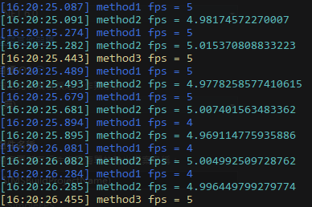

# SimpleFPS

This is a simple FPS calculation tool.




## Getting Started

Import the following namespace.

```c#
using aiRobots;
```


Initialize `SimpleFPS` using the following methods.

```c#
SimpleFPS fps_tool_m1;
SimpleFPS fps_tool_m3;
AverageFPS fps_tool_m2;
    
// method 1
fps_tool_m1 = new SimpleFPS();

// method 2
fps_tool_m2 = new AverageFPS();

// method 3 
fps_tool_m3 = new SimpleFPS();
fps_tool_m3.FPSUpdated += (object sender, SimpleFPS_Args e) =>
{
    msg_out($"method3 fps = {e.FPS}", fore: ConsoleColor.Yellow);
};
```


Place `FPSUpdate` where you want to measure FPS

```c#
// FPS method1: basic fixed time frame number method
fps_tool_m1.FPSUpdate();
msg_out($"method1 fps = {fps_tool_m1.FPS}", fore: ConsoleColor.Blue);

// FPS method2 by average sampling time method
fps_tool_m2.FPSUpdate();
msg_out($"method2 fps = {fps_tool_m2.FPS}", fore: ConsoleColor.Cyan);

// FPS method3: update by event
fps_tool_m3.FPSUpdate();
```


## Example

**Program.cs**

```c#
using aiRobots;

System.Timers.Timer interval_timer;
SimpleFPS fps_tool_m1;
SimpleFPS fps_tool_m3;
AverageFPS fps_tool_m2;

void initial()
{
    // method 1
    fps_tool_m1 = new SimpleFPS();

    // method 2
    fps_tool_m2 = new AverageFPS();

    // method 3
    fps_tool_m3 = new SimpleFPS();
    fps_tool_m3.FPSUpdated += (object sender, SimpleFPS_Args e) =>
    {
        msg_out($"method3 fps = {e.FPS}", fore: ConsoleColor.Yellow);
    };

    // init interval timer
    Console.WriteLine("initial timer with tick...");
    interval_timer = new System.Timers.Timer(200); // interval 200 msec => fps 5
    interval_timer.Elapsed += timer_tick;
    interval_timer.AutoReset = true;
    interval_timer.Enabled = true;
}
void deinitial()
{
    interval_timer.Enabled = false;
}
void press_enter()
{
    System.Console.WriteLine("press enter to close...");
    System.Console.ReadLine(); //block
}
string now()
{
    return System.DateTime.Now.ToString("HH:mm:ss.fff");
}
void msg_out(string msg, ConsoleColor back = ConsoleColor.Black, ConsoleColor fore = ConsoleColor.White)
{
    Console.BackgroundColor = back;
    Console.ForegroundColor = fore;
    Console.WriteLine($"[{now()}] {msg}");
    Console.ResetColor();
}

void timer_tick(Object source, System.Timers.ElapsedEventArgs e)
{
    // FPS method1: basic fixed time frame number method
    fps_tool_m1.FPSUpdate();
    msg_out($"method1 fps = {fps_tool_m1.FPS}", fore: ConsoleColor.Blue);

    // FPS method2 by average sampling time method
    fps_tool_m2.FPSUpdate();
    msg_out($"method2 fps = {fps_tool_m2.FPS}", fore: ConsoleColor.Cyan);

    // FPS method3: update by event
    fps_tool_m3.FPSUpdate();
}

initial();
press_enter();
deinitial();

```


